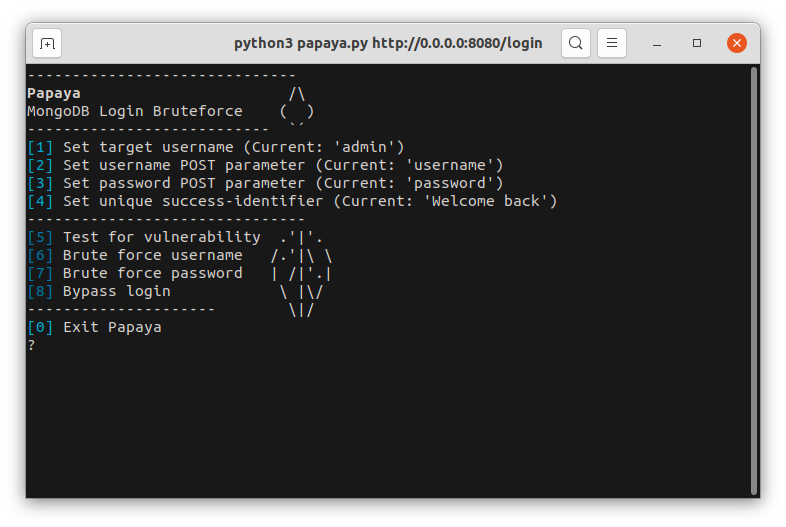

# Papaya



Papaya is a tool to test if a MongoDB/NoSQL-based web application is vulnerable to a basic nosql injection on POST login forms, including tests for password and username extraction.

The attack works by injecting nosql's $regex and $eq operators on passwords and usernames.

### Usage
```
python3 papaya.py TARGET_URL
```
- test for vulnerability
- if application is vulnerable, search for a string that is unique in the positive response and set it as the identifier
- choose an attack

### Dependencies
```
pip install -r requirements.txt
```
